footer: @EvilTester
slidenumbers: true
<!-- page_number: true -->

# Your Open Source Profile

Open Quality Conference 2020

Alan Richardson

- [@EvilTester](https://twitter.com/eviltester)
- [EvilTester.com](https://eviltester.com)
- [compendiumdev.co.uk](https://compendiumdev.co.uk)
- [digitalonlinetactics.com](https://talotics.com)

---

# What we will cover

---

# Everyone Can Open Source

- My relationship with Open Source
- Theory of Open Source
- Psychology and Attitude to Open Source
- Approaches and Tooling

---

# What is This Talk About?

Marketing and Sharing

- Marketing
   - Get attention, so they see what you are sharing.
   - Discoverability is vital.
- Sharing
   - Share stuff that has value, to keep attention.

---

# What is Open Source?

>"The term open source refers to **something people can modify** and share because its **design is publicly accessible**."

[opensource.com/resources/what-open-source](https://opensource.com/resources/what-open-source)

---

# What comes to mind when you think about open source?

- "Source Code"
- "Open Source Tools and Libraries"

e.g. WebDriver, REST Assured, Robot Framework, Tutorial Code, etc.

_Thinking like this can reduce participation to programmers only._

---

# What are some attributes of open source?

- Free to access
- Downloadable
- Source of Learning
- In a format that can be changed

---

# Going Meta

> “Reframing is also the pivotal element in the creative process: it is the ability to put a commonplace event in a new frame that is useful or enjoyable.”

― Richard Bandler, Reframing: Neurolinguistic Programming and the Transformation of Meaning

_Reframe Open Source to permit creative access to everyone._

---

# What comes to mind for: "Open"

- Welcome, Come in, Join Us
- Access, Permission, No Barrier

---

# What comes to mind for: "Source"

- "Source of Knowledge"
- To Obtain
- someone or something that supplies information
- Place where something comes from

---

# Not Code. Not Libraries.

---

# Going Meta - Beyond Code

What do you have that is:

- something people can modify?
- something people can share?
- design is publicly accessible?

Probably more than you think.

---

# Examples Beyond Code

- Social Networks sharing your sources of learning and experience
- Blogging is open sourcing your thinking
- SlideShare (etc.) for releasing presentations
- YouTube for videos and examples
- Podcasts for thoughts and interviews

---

# Used together, all of this is a content web and your online open source portfolio.

---

# 'Code' hosting

Github can be used to host more than code

- e.g. 'lists' of stuff,
- testing notes,
- the raw posts for blogs,
- 'cheat sheets'.
- etc.

---

## There are so many ways you can share your knowledge and experience and contribute to the Open Sourcing of Value.

---

# Paths to Follow

---

# An Adhoc Path

- Moments and Glimpses
    - Social Media
        - Share stuff you find interesting
    - Code Snippets on Gist
- Stakes in the Ground
    - Blog thoughts and experiences
- Incremental Development
    - Share Code as Example Projects on GitHub

   

---

# An Open Source Path Overview

- Social Media Profiles
- Social Media Platforms
- Curate Information Sources
- Share your examples
- Share your what you learned
- Product Creation
- Teach
- Build a Mixed Media Content Web

---

# Results of 25 Years Open Sourcing

---

# Some results of 25+ years of an Open Source Profile

- 670+ blog posts on multiple blogs
- 120+ Public Repositories on Github
- 320+ YouTube Videos
    - 370+ (I have some 'secret' YouTube Channels)
- 10+ Training Courses, 4+ Books, 10+ Tools

**Note: 25+ years** this is a gradual and incremental process of deliberate sharing and value add.

---

# What if we shared everything?

- Create multiple channels
- Create more options for sharing

---

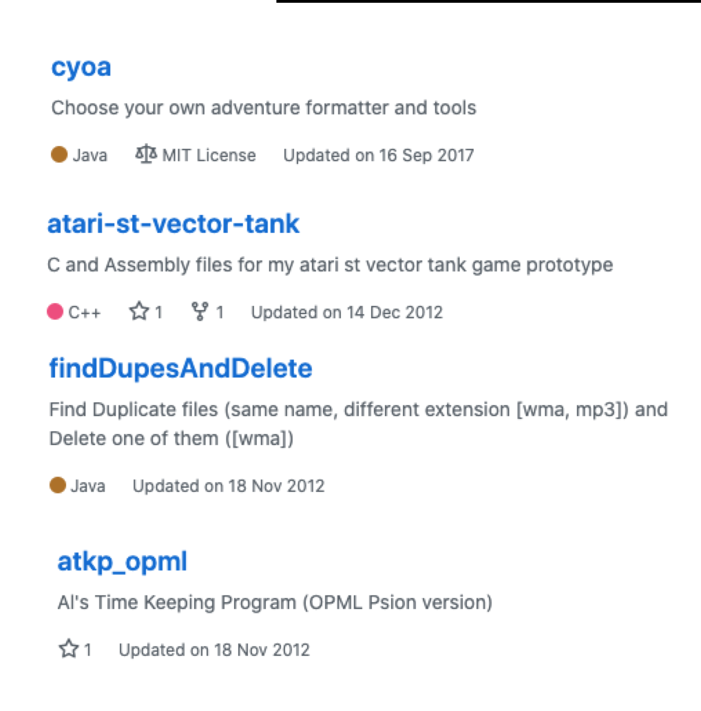

---

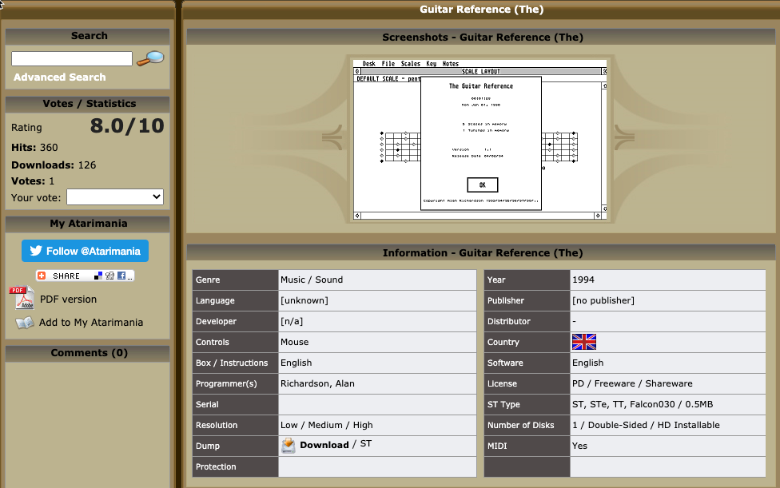

---

# Psychology

---

# Motivations

---

## Personal Benefits

- Skill Improvements
- Teaching Strengthens Your Knowledge
- Experiment
- Get Your Message Out

---

## Public Benefits

- Increased Profile
- Hard to assess

Public Benefits are a Secondary Gain.

---

## No Guarantees

- Hiring Companies often don't review public profiles
- But if people look, then your public profile gives you an edge
- Sowing Seeds, Grow in Unexpected Ways

---

# Objection Handling

> Treat objections as requests for further information.

- Brian Tracy

---

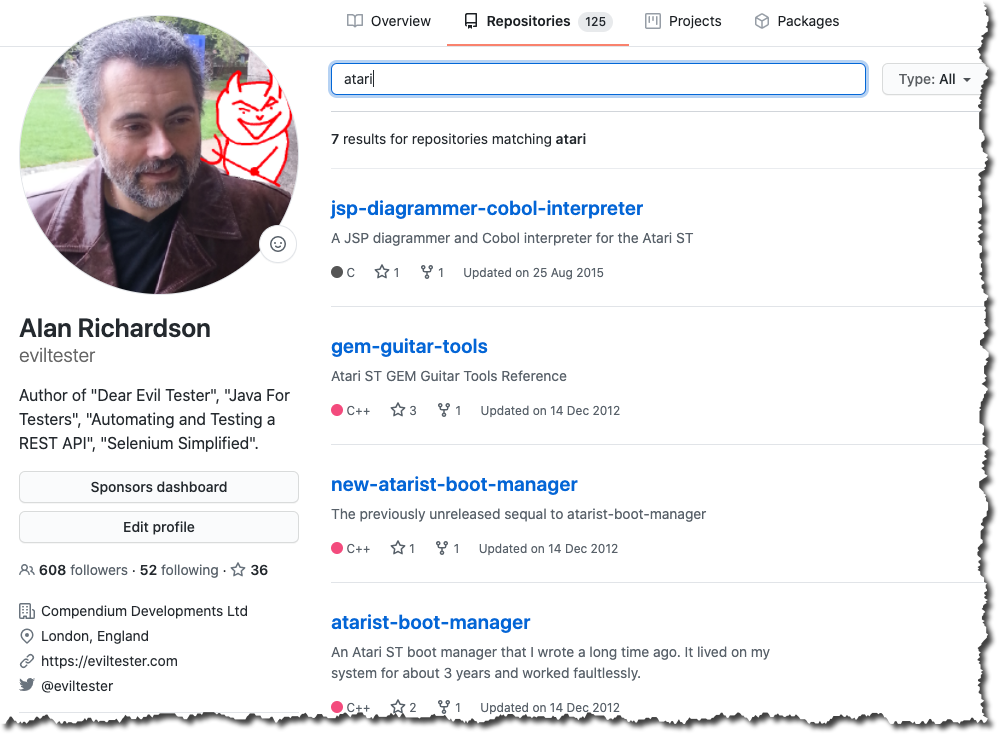

---

# Objections

- I don't want to show my mistakes
    - Everyone makes mistakes
- I'm still learning
    - So is everyone else
    - That's why sharing is important

---

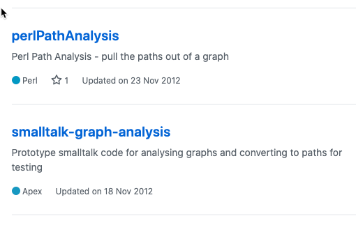

---

# Objections

- I'm not an expert
    - We share learning and experience, not expertise
- I don't want to show my limits
    - Limits are time bound
    - Keep sharing

---

# Objections

- I might not be good enough
    - Your Experience
    - Your Learning
    - Do not compare
- I can't share my work it is proprietary
    - Generalise
    - Create new examples
    - Show what you learned through your work

---

# The more you share...

...the less you care:

- about what people think,
- or if the older stuff stinks.

You moved on,.
And to new stuff you are drawn.

---

# The "Just Share" Exercise

Every day for a week:

- create an instagram 'thoughts' video
- create a tweet about your day
- create a micro blog post

---

# Work through the objections:

- Why?
- What would happen if we did?

---

# Attitude

---

# Positive Attitude

You've got to love the:

- the output
    - what you create and share share
- the process, the act of creation
- the learning
    - improving the act of creation and sharing

---

# Because sharing takes work.

---

# Negative Reinforcement

- Not for External Reinforcement

---

# Share to Shape the world

---

> “I criticize by creation, not by finding fault.”
>
> - Marcus Tullius Cicero

---

# "I must create a system or be enslaved by another mans; I will not reason and compare: my business is to create."

## William Blake, Jerusalem

---

# Examples

Most of the examples are mine.

- Not to show off.
- But so I can explain
   - Why?
   - How?
   - What Worked?
   - What Didn't?

---

# Approaches

- Pointers to Information
- Micro Blogging
- Semi-Permanent Stakes in the Ground
- Time Bound Positions
- Evolving Ideas
- Monetised Output

---

# Approaches Instantiated

- Pointers to Information
    - social posts
- Micro Blogging
    - short social posts, Tweet Storms, Instagram
- Semi-Permanent Stakes in the Ground
    - Blogs, LinkedIn Posts
    - Editable

---

# Approaches Instantiated

- Time Bound Positions
    - Anything you can't edit when posted
        - YouTube, SlideShare, Podcast
    - You can always delete later
- Evolving Ideas
    - Github, Code projects
- Monetised Output
    - Books, Training

---

# twitter.com/eviltester

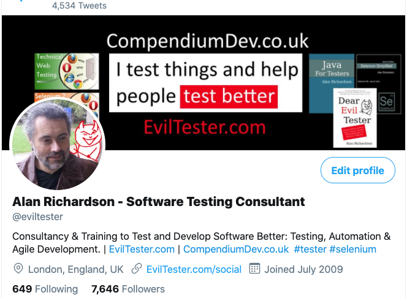

---

# Notes

- Open Source What?
   - Share links, thoughts, pointers
   - Micro-blog through TweetStorms
- Image created in Paint.net, and getstencil.com
- Repurposing strategy
    - start on Twitter, then expand on a blog
    - write a blog, then summarise on Twitter
- Social Network? Content Sharing Platform?

---

# How to Use Twitter

- Want lots of followers?
    - Use it as a social network.
    - Follow and interact
- Discoverability (via search)
    - SEO for your profile
    - use keywords, hashtags in your posts
- Retweet and Quote
    - add value when you retweet
    - add additional hashtags

---

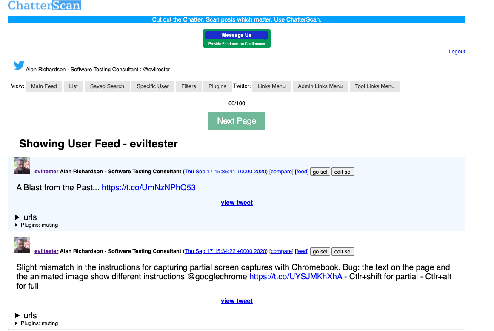

---

# Chatterscan,com

- Learning from others.
- Looking for shared links to content.
- I wrote an open source tool to help me
    - [Chatterscan.com](https://chatterscan.com)
    - [github.com/eviltester/chatterscan](https://github.com/eviltester/chatterscan)

---

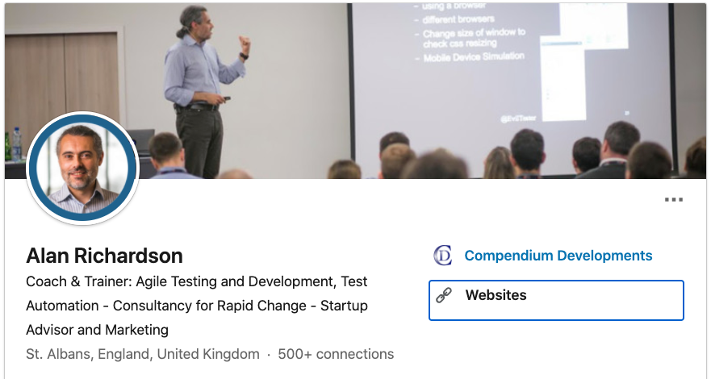

---

# LinkedIn Profile Notes

- Keep it professional
- Do add personal photo
- Do add professional banner
- Do use tag line effectively
- SEO on linkedin applies to all
- Create a good description
    - read other peoples
    - use unicode for formatting

---

# Link to your projects

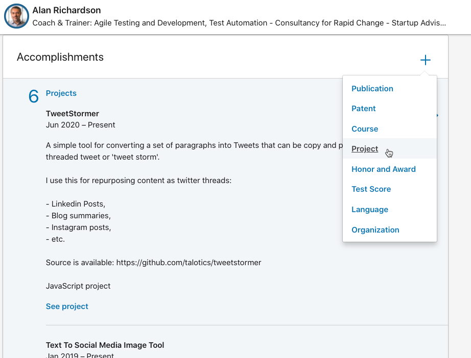

Promote your Open Source Content as projects or publications.

---

# LinkedIn Posts are Open Sourced Thinking and Sharing

- Micro Blogs
- Share Links to Content
    - Mine and Others
- Reshare other people's posts

ranked in order of success - measured by views

---

# I Avoid

- too many opinions
- non-work stuff
- but I don't use it as a social network

Find out what works for you.

---

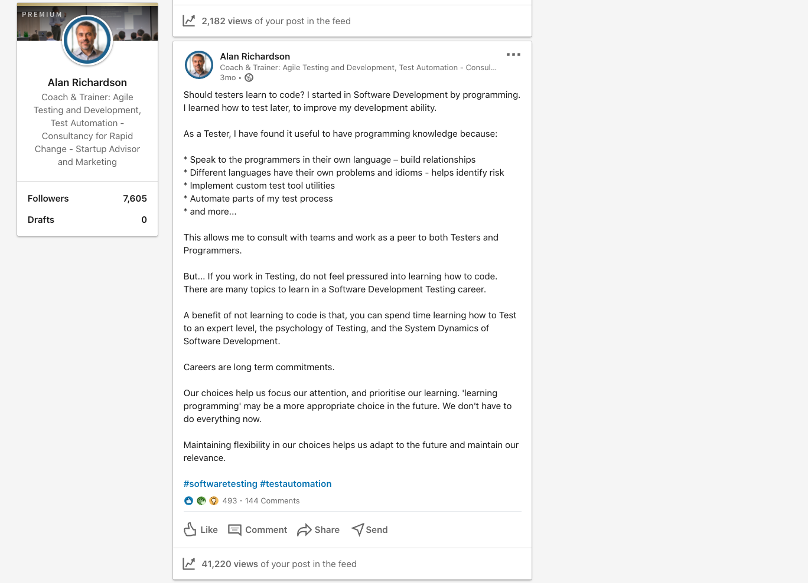

---

# Example Post Notes

- 40,000+ views
    - organic, meaning anyone can achieve these numbers with the right post
- a Micro blog post
    - Sharing Experience and Advice
- hashtags for discoverability
- SEO keywords in text
- Repurposed from a blog post

---

# Posts are Transient

- Short Lived
- Content 'lost' over time
- Repurpose micro blogs into longer lived long form content
   - e.g. combine contents of 2 or 3 posts into a blog post or LinkedIn Article

---

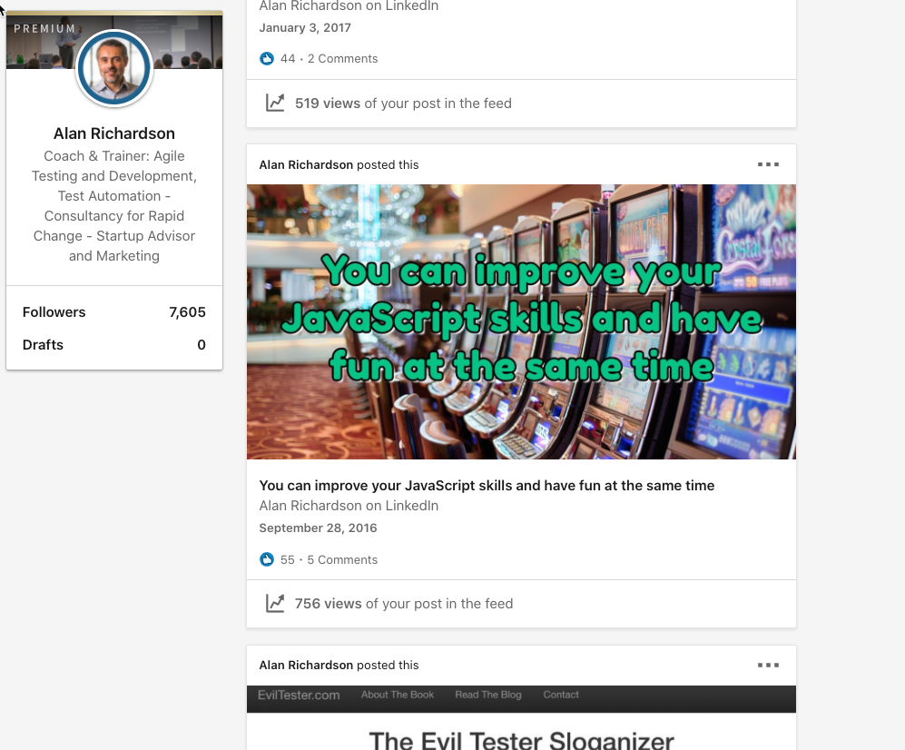

---

# Linkedin Articles are an instant blogging platform

- 'locked' to LinkedIn
- they are indexed by search engines
- can be viewed without a LinkedIn account
- metrics suggest they don't get seen as much as posts
- they are longer term
- you could start 'blogging' using LinkedIn
    - then syndicate to other sites later

---

# How to Use LinkedIn

- Share Content as Posts and Articles
- Connect, because then people see your shared content
- Connect with a message
    - No message, causes more work for the other person.
    - Do not immediately follow with an "Ask"
    - You are there to "Share", not to "Take"

---

# LinkedIn is a Content Plaform

Don't think of LinkedIn as a networking platform.

- think of it as a content sharing platform. Articles, Posts, Documents.
- and as a way of showing off any projects you are working on

---

# You don't need to wait to get started

Twitter and LinkedIn allows you to:

- blog share your knowledge
    - as long content articles
    - as micro blog 'posts' & 'tweetstorms'
    - upload media you want to open source
         - pdfs, videos
- curate content
- share links to useful information

---

# Instant Access

"I need to create a blog"

- or just start posting on Linkedin
- collate posts into an article on Linkedin
- or write docs and power points ad post them to LinkedIn or SlideShare
- Cross promote on Twitter

No Excuses. You can have a running start.

 

---

# Blogging

You can host your blog on:

- Wordpress, Blogger, Medium, etc.

If you do, add a domain name.

Use hosted service, do not self host. More secure, less maintenance.

---

# Recommended Blogging

I recommend using a static generator and hosting for free:

- Static Generator: HuGo, Jekyll

- Free Hosting: Netlify, GitPages

You can add domains you own here for free.

---

## Repurpose Content

- All content has a 'canonical form'
   - e.g. code (Github), app (hosted or download), blog post
- All content can have 'shared forms'
    - Linked to in Tweets

---

# Syndication of Blogs

- RSS feed for personal syndication
- Submit RSS feed to Aggregators
    - https://www.ministryoftesting.com/feeds/blogs
- Content Syndication via repost to
    - [Dev.to](https://dev.to), [DZone](DZone.com)
    - Medium (paywall, not used)
    - add canonical link, and edit content for backlink e.g. (originally published at ...)

---

# Key Principles

- Add Value
    - Curate, Your Experience, Your Learning
- Give more than you Ask
- Optimise for Discoverability
    - Open Sourcing Information has an advantage here

---

# Social Profiles

- Create accounts on social:
   - Twitter
   - Instagram
   - YouTube

- Use the same 'handle' if possible. But it does not matter if you can't.
- You can't share anything if you don't have access, even if you don't use it, you now have the option.

---

# PRINCIPLE: Maximise the options open to you for sharing value..

---

# Natural Style

You will have your own natural style which fits different platforms.

- Share Everything (Twitter)
- Love to Comment (Twitter, Linkedin)
- Long Form Content (Linkedin, Facebook, cross promote on Twitter)

Do what is comfortable.

---

# Own Your Platform

At some point you'll want to own your platform:

- blog, web site, etc.

So:

- GET A DOMAIN NAME
    - worry about hosting later
    - you can move and redirect later

---

# Using GitHub For Information Hosting

- Create an account
- Create a Github Readme
   - As a minimum, you could now share information through your readme.

---

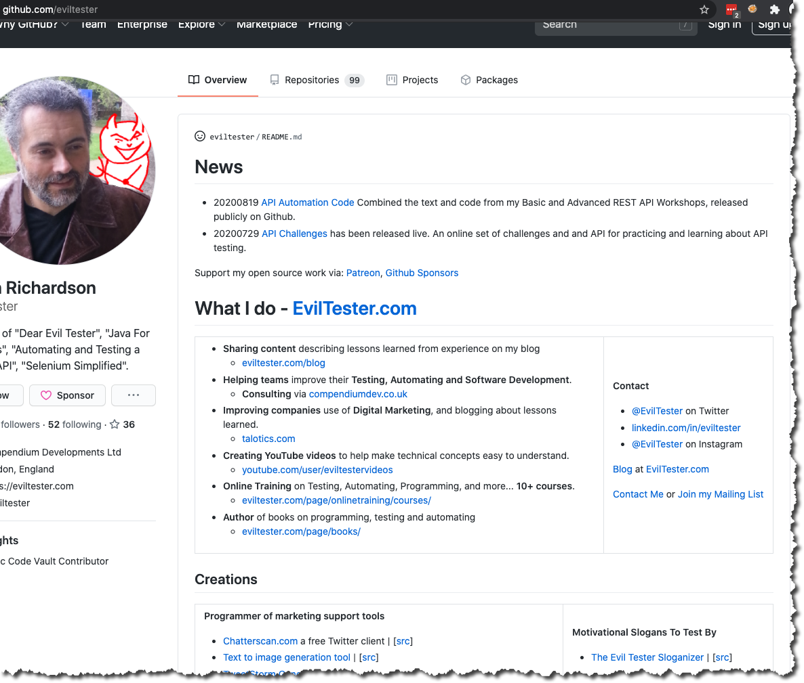

---

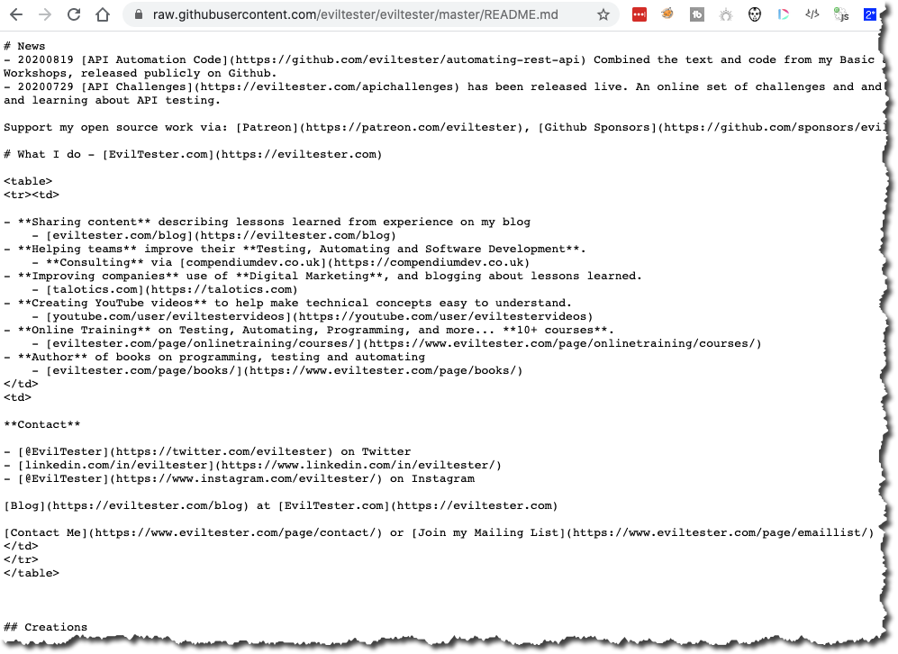

---

# Github Readme

- GitHub Readme - Frontpage of GitHub Profile
   - [github.com/matiassingers/awesome-readme](https://github.com/matiassingers/awesome-readme)
   - It is just markdown

---

# My profile as an example

- preview
    - [github.com/eviltester](https://github.com/eviltester)
- Repo
     - [github.com/eviltester/eviltester](https://github.com/eviltester/eviltester)
- Content
    - [raw.githubusercontent.com/eviltester/eviltester/master/README.md](https://raw.githubusercontent.com/eviltester/eviltester/master/README.md)

---

# Github Repos are not just for code

- e.g. [github.com/eviltester/gitpagestest](https://github.com/eviltester/gitpagestest)
- this is an example 'blog' using GitPages

These repos show various ways of building and hosting web sites.

- [HuGo Docs gohugo.io](https://github.com/gohugoio/hugoDocs)
- [Netlify Hugo Example Site](https://github.com/netlify-templates/victor-hugo)

---

 files in the code
   - links to videos on youtube
   - links to blog posts with more information
   - as well as code

---

# Use Gist to share code snippets

[gist.github.com/eviltester](https://gist.github.com/eviltester)

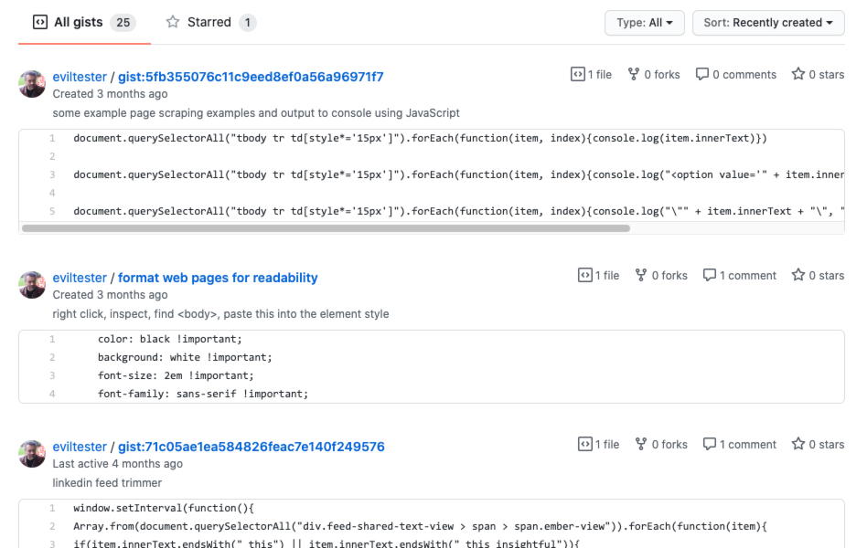

---

---

# Code and App Hosting on Github

- GitHub
   - normal use for code
- Can be used to host JS and HTML Apps e.g.
   - code
        - [github.com/eviltester/simpletodolist](https://github.com/eviltester/simpletodolist)
   - App
        - [eviltester.github.io/simpletodolist/todolists.html](https://eviltester.github.io/simpletodolist/todolists.html)
- Also consider Netlify for JS and HTML app hosting

---

# Heroku For Free App Hosting

- [Heroku.com](https://www.heroku.com/)

I host:

- [apichallenges.herokuapp.com/](https://apichallenges.herokuapp.com/)
- [testpages.herokuapp.com/](https://testpages.herokuapp.com/)
- [thepulper.herokuapp.com/](https://thepulper.herokuapp.com/)

---

# Free Continuous Integration

- Travis CI
    - [travis-ci.org/github/eviltester](https://travis-ci.org/github/eviltester)
- GitHub Actions
   - [github.com/eviltester/junitexamples/actions](https://github.com/eviltester/junitexamples/actions)

Build project, run tests, when commit. Can be a full CI pipeline.

---

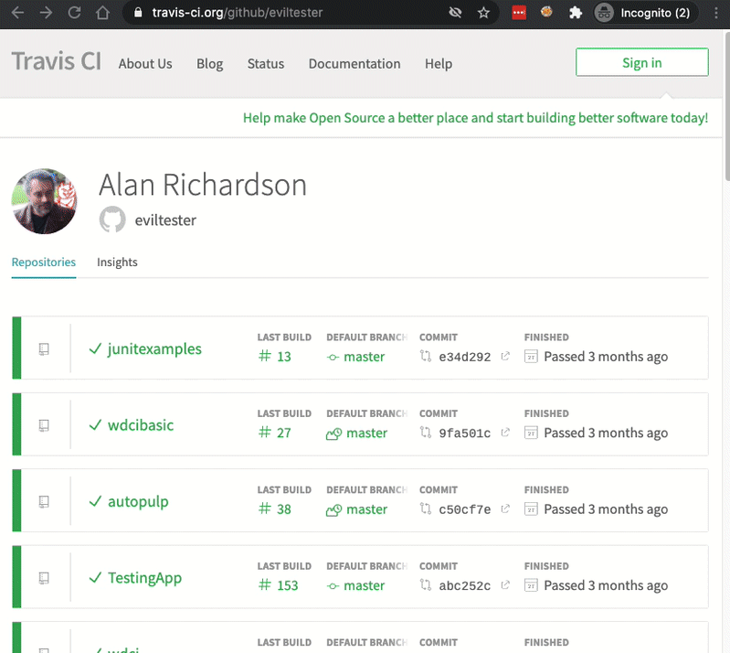

---

---

# Incredibly Low Barriers to Entry Now

---

# If you had to open source something now, what would it be?

---

# If you had to open source something now, what would stop you sharing?

- Psychology?
    - "Treat objections as requests for further information." Brian Tracy
    - Figure out your "Why?"
- Platform Access?
    - Setup accounts on all social media
    - setup a blog using GitPages, Netlilfy, Wordpress

---

# Lack of Ideas?

- Share what you learned
- Share what you experience
- Share what stopped you
- Share what you will try next

---

## We can all Open Source

>"The term open source refers to **something people can modify** and share because its **design is publicly accessible**."

[opensource.com/resources/what-open-source](https://opensource.com/resources/what-open-source)

---

## Alan Richardson - Partial Open Source Profile

- blogs: [eviltester.com](https://eviltester.com), [talotics.com](https://talotics.com)
- social: [twitter.com/eviltester](https://twitter.com/eviltester), [linkedin.com/in/eviltester](https://uk.linkedin.com/in/eviltester), [instagram.com/eviltester](https://www.instagram.com/eviltester/)
- code: [github.com/eviltester](https://github.com/eviltester)
- videos: [youtube.com/c/EvilTester](https://www.youtube.com/c/EvilTester)
- Podcast: [eviltester.com/show](http://eviltester.com/show)

Q&A

---

# Extras

All the stuff I couldn't fit into the talk.

---

# Tools

---

## TweetStorms

- Threaded Tweets that act as a micro blog.
- Create by replying to an earlier Tweet.
- Often have (1/x) counts to let you know how many Tweets are in the Thread.

I wrote an open source tool that helps me create TweetStorms:

- [talotics.com/apps/tweetstormer/tweetstorm-tool](https://talotics.com/apps/tweetstormer/tweetstorm-tool/)

---

## Image Tooling

- [getStencil](https://getstencil.com)
- [getPaint.net](https://www.getpaint.net/) (windows)
- [gimp.com](https://gimp.com)

---

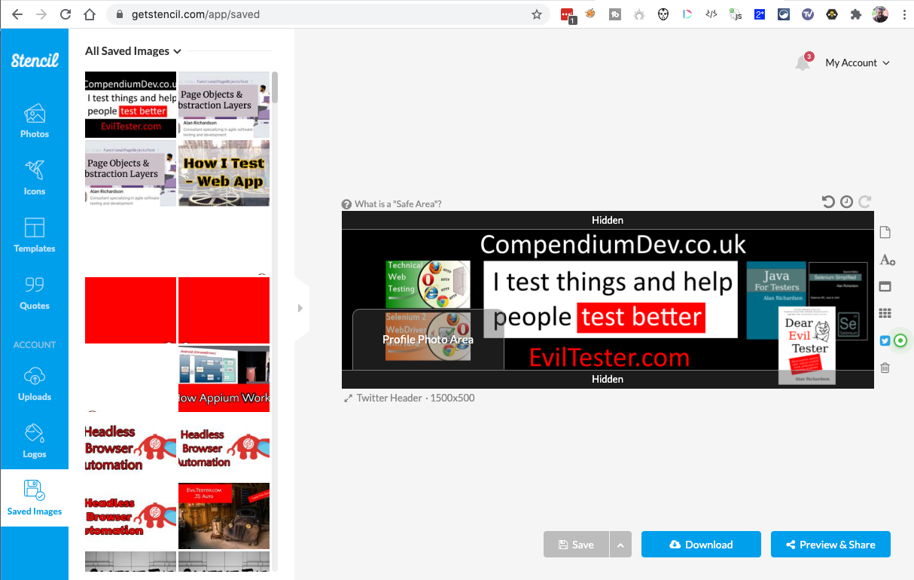

---

## Free Social Media Scheduling Tools

- [Buffer](https://buffer.com/)
- [Later](https://later.com/)

---

## Recommended Static Generation Blogging Tools

- HuGo (my preferred choice)
- Jekyll
    - native support in GitPages
    - e.g. [github.com/eviltester/gitpagestest](https://github.com/eviltester/gitpagestest)

---

## Recommended Free Static Blogging Hosts

- Netflify
    - Hosting Examples Code
    - [github.com/netlify-templates](https://github.com/netlify-templates)
        - Covers HuGo, Jekyll, Gatsby and other static site generators
- GitPages
    - Only for non-commercial sites, for commercial use Netlify
    - I use for 'tooling pages'

---

## Tooling I use for writing and drafting

- [Evernote](https://evernote.com/)
    - for ubiquitous storage
- [Visual Studio Code](https://code.visualstudio.com/)
    - For MarkDown Editing and preview

---

- [IntelliJ IDE](https://www.jetbrains.com/idea/)
    - Markdown Preview
    - Copy and Paste from Preview into Rich Edit fields
- Converting Markdown to HTML
    - [markdowntohtml.com](https://markdowntohtml.com/)
    - [dillinger.io](https://dillinger.io/)
   

---

## Creating Slides from Markdown

- [Marp](https://yhatt.github.io/marp/)
- [Marp.app](https://marp.app/)

Paid Tools:

- [DeckSet](https://www.deckset.com/)

---

## email Lists

- [MailChimp](https://mailchimp.com/)
- [SendFox](https://sendfox.com/)

---

# Practical Steps

---

## Repurpose Transient Content

Repurpose and re-use your social content.

- Convert from micro blog to full blog post
- Curate links shared into a blog post
- Combine micro blogs and observations

---

## Watch, Star and Follow on Github

On Github:

- Star a repo to add it to your list of 'bookmarks'
- Watch a repo to receive notifications when it changes
- Follow people - helps make them easier to find again and might 'motivate' those people

---

## Sharing via Social Profiles

- Transient
- a Moment in Time
- Short Glimpses

---

## Create domain name early

- Eventually create all content under a domain you own e.g.
    - NO
        - eviltester.blogspot.com,
        - eviltester.wordpress.com
    - YES
        - EvilTester.com

Link from here to other platforms.

---

# Case Study: This Talk

---

## Open Source Tools Used

- [FreePlane Open Source Mind Map Tool](https://www.freeplane.org/wiki/index.php/Home)
   - Fork of FreeMind, supports Scripting
- [Github](https://github.com/eviltester/open-source-profile)
   - Initially Private, then Public when Talk is 'visible'
- [EvilTester MindMap to Markdown script](https://github.com/eviltester/mm-script-repo/tree/master/export-node-notes-as-markdown)
- [Marp](https://yhatt.github.io/marp/)
   - to prototype the presentation

---

- [Pandoc](https://pandoc.org/) - to create handouts from Markdown
- [HuGo](https://gohugo.io/) EvilTester.com is written in HuGo [Talk Page](https://www.eviltester.com/conference/openquality2020_conference/)

---

## Free SAAS and Hosting

- [Netlify](https://www.netlify.com/) - EvilTester.com is hosted on Netlify, with source on Github
- SlideShare to host the final pdf of the talk
- SpeakerDeck to host the pdf (allows updating new versions)
- Upload slides to LinkedIn as a 'document' post
- Github - to view the markdown on site

---

## Closed Source Tools Used

- [DeckSet](https://www.deckset.com/)
   - To create 'pretty' 'pro' slides
- [SnagIt](https://www.techsmith.com/screen-capture.html)
   - for screenshots

---

## Creating an Open Source Talk Process

- Talk and material initially stored locally on HD
- Talk planned and built in FreePlane
    - (.mm files are xml so easy to add to Git)
- Private repo created to store material
- Generate slides as Markdown and Preview/Order in Marp
- Publicly release repo when talk active
- Aid discoverability through social sharing

---

## Repurposing

Cornerstone of Social Media Marketing and helping people find the value you share.

- Collate social shares into blog posts
- Share blog posts multiple times with a different value quote each time
- Revisit blog posts and create videos from them
- Transcribe videos and create blog posts
- Convert code examples into an explanatory blog post
- etc.

---

## Content Web

We are creating a web of related content.

And repurposing content to:

- promote and make our content discoverable
- create new content for different platforms
- add backlinks into description fields

---

## What Can I Share?

- Curated Information
- Lists of "Links"
- Lessons Learned as a 'post'
- Examples and Case Studies
    - Experience Reports
    - Code

---

## How to Find "Lists"

Many of these were taken from my 'starred' or 'watched' repo list.

I also added more by searching on github for:

- "Testing Workshop"
- "Rest Workshop"

And the wider internet for: "github awesome list"

---

## Awesome Lists

An "Awesome List: is a collated list of resource links.

Sharing lists of resources you have found useful.

- [Sindre Sorhus List of Awesome Lists]https://github.com/sindresorhus/awesome
- [Jan Vlnas List of Lists](https://github.com/jnv/lists)
- [Alexander Bayandin List of Awesome Lists](https://github.com/bayandin/awesome-awesomeness)

---

## Example Lists

- [Paul Maxwell-Waters List of Testing Resources](https://github.com/PaulWaltersDev/FreeLearningResourcesForSoftwareTesters)
- [Unmesh Gundecha List of Testing Courses](https://github.com/upgundecha/awesome-testing-courses)
- [Abhijeet Vaikar List of Test Approach Write Ups](https://github.com/abhivaikar/howtheytest)
- [Ben Sadeghipour Bug Bounty Beginner Resource List](https://github.com/nahamsec/Resources-for-Beginner-Bug-Bounty-Hunters)
- [Mike Gifford List of Accessibility Testing Learning Resources](https://github.com/mgifford/a11y-courses)
- [The Book of Secret Knowledge](https://github.com/trimstray/the-book-of-secret-knowledge)

---

## Open Source Books

- [List of Free Programming Books](https://github.com/EbookFoundation/free-programming-books)
- [Pro Git](https://github.com/progit/progit2)
- [Selenium Simplified RC Book](https://github.com/eviltester/seleniumSimplifiedRCBook)
- [The Rust Programming Language Book](https://github.com/rust-lang/book)
- [Deep Learning 101 with PaddlePaddle](https://github.com/PaddlePaddle/book)
- [You Don't Know JS Yet](https://github.com/getify/You-Dont-Know-JS)

---

## Books And Handouts

Repositories filled with Open Source Long form content:

- [Public Penetration Testing Reports List](https://github.com/juliocesarfort/public-pentesting-reports
)
- [OWASP Cheat Sheets](https://github.com/OWASP/CheatSheetSeries)

---

## Collated Code Snippets

Code snippets and copy paste items.

- [Weaponised XSS Payloads](https://github.com/hakluke/weaponised-XSS-payloads)

---

## Training Courses and Workshops

- [Kent C Dodds JavaScript Testing Workshop](https://github.com/kentcdodds/testing-workshop)
- [Ken Kousen JUnit 5 Workshop](https://github.com/kousen/junit5_workshop)
- [Amber Race Explore with Postman](https://github.com/ambertests/explore-with-postman)
- [Umar Hansa Learn Browser Testing](https://github.com/umaar/learn-browser-testing)
- [Bas Dijkstra REST Assured Workshop](https://github.com/basdijkstra/rest-assured-workshop)
- [Alan Richardson REST API Testing and Automating Workshops](https://github.com/eviltester/automating-rest-api)
- [Hacker 101](https://github.com/Hacker0x01/hacker101)

---

## Web Sites

These repos show various ways of building and hosting web sites.

- [HuGo Docs gohugo.io](https://github.com/gohugoio/hugoDocs)
- [Netlify Hugo Example Site](https://github.com/netlify-templates/victor-hugo)
- [JetBrains Kotlin Website](https://github.com/JetBrains/kotlin-web-site)
- [HTML5Accessibility.com](https://github.com/stevefaulkner/HTML5accessibility)
